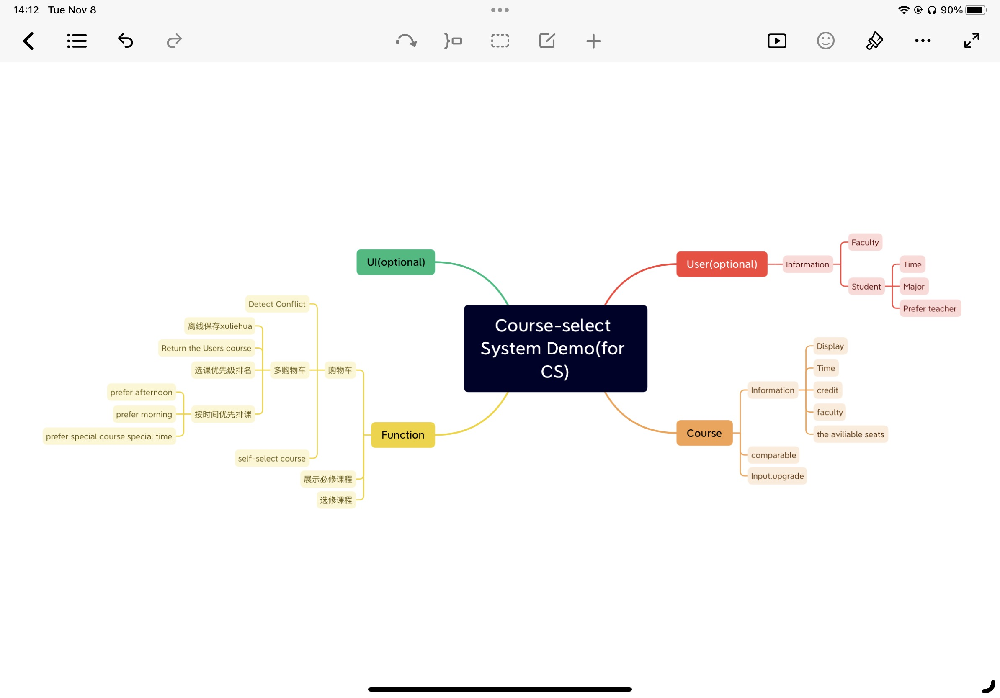

# course-selectSystem
 2232FinalProject

## 整体结构的初步构想
- data文件夹
  - course存放课程相关 info为各节课对象序列化存储的文件夹
  - User为用户文件夹
    - Faculty 教师对象存放
    - Student 学生对象存放
      - students
    - shopping cart 购物车
1. 实现Course, Faculty, Student, Shoping cart序列化
   1. 实现4个类的toString方法
   2. 实现类内存储与读取（即序列化和反序列化）
2. 完善Faculty类
   1. 若课程涉及此教师，则教师所上的课便加上这一课程。
3. 完善购物车系统（可以用linklist存，这样就是按照存入顺序输出。.contain也是有的）
   1. 实现时间冲突选项
      1. Data数据的完善
         - 分别为Start Day End Day 作为起止日期
         - Days[]一维数组保存周几上课
         - StartTime EndTime 保存具体上下课时间（通常为第一节课的时间）
   2. 实现学分检测
   3. 实现检测是否完成前置课程
   4. 检测是否是本年级学生课程
   5. 实现课程容量检测（这个放到course里实现，学生+1就-1可用）
   6. Optional:注册与选择分离
4. 课程预览
   1. 将所有课程实例化
   2. 考虑用什么存储课程（课程很多，如何读取和输出最快，按照什么排序）
   3. 多种类搜索（自定义搜索）
      1. 限定时间，学分，教师
   4. 多种类排序（自定义排序）
      1. 按照时间，学分，课程ID，课程编号
   5. 特殊化ADT，如BST
## 新增 12.04
- 将course所有方法实现调用course对象序列化存储
- 构建course调用反序列化，如果不存在则创建一个新的对象，存在则读取反序列化中的对象
- 将linklist复写，新写方法如重新排序，按....来
- 购物车作为一个linklist可以存入course类的对象
  - 在浏览课程列表时，可以将课程列表中即Arraylist中的对象存入购物车中即Linklist
  - 实现linklist的toString输出。

## version1
